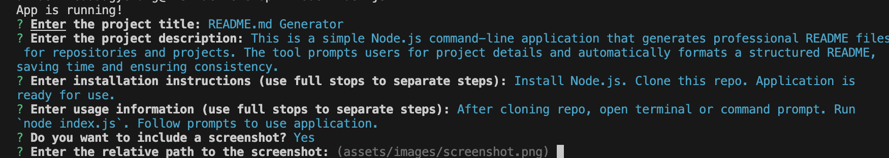

# README.md Generator


## Description
This is a simple Node.js command-line application that generates professional README files for repositories and projects. The tool prompts users for project details and automatically formats a structured README, saving time and ensuring consistency.

## Table of Contents
- [Installation](#installation)
- [Usage](#usage)
- [License](#license)
- [Badges](#badges)
- [Features](#features)
- [Contributing](#contributing)
- [Tests](#tests)
- [Questions](#questions)

## Installation

- Install Node.js
- Clone this repo
- Application is ready for use.


## Usage

- After cloning repo, open terminal or command prompt
- Run `node index.js`
- Follow prompts to use application.

### Screenshot

```md

```


## License
This project is licensed under the **MIT** license.

## Badges


## Features
- License choice
- Contributions
- Badges
- Point separator for installation and usage instructions for readme file.
- Directory creator for when directory for images does not exist.
- Creates README in markdown text.

## Contributing
none

## Tests
Run `node index.js`

## Questions
For any questions, reach out to me:

- GitHub: [dtsagli960](https://github.com/dtsagli960)
- Email: danieltsagli960@gmail.com
